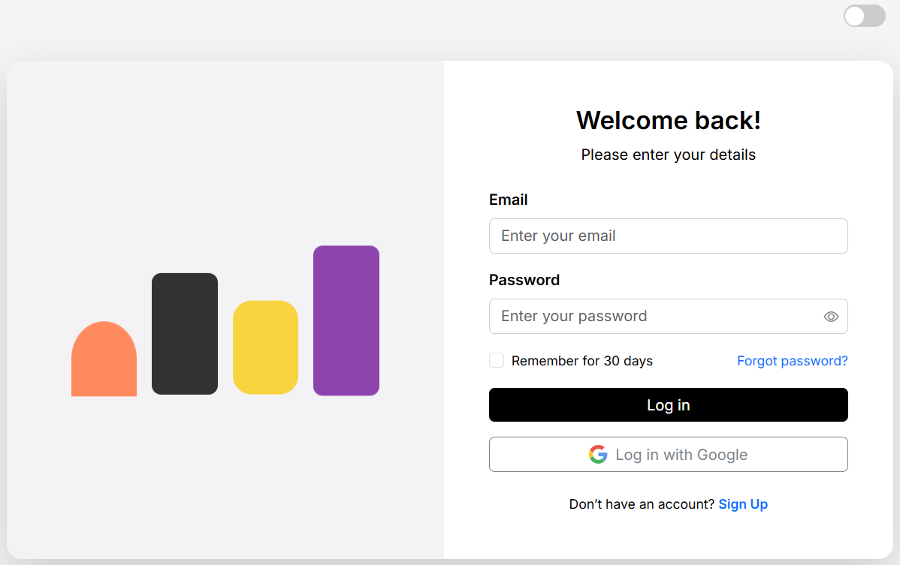
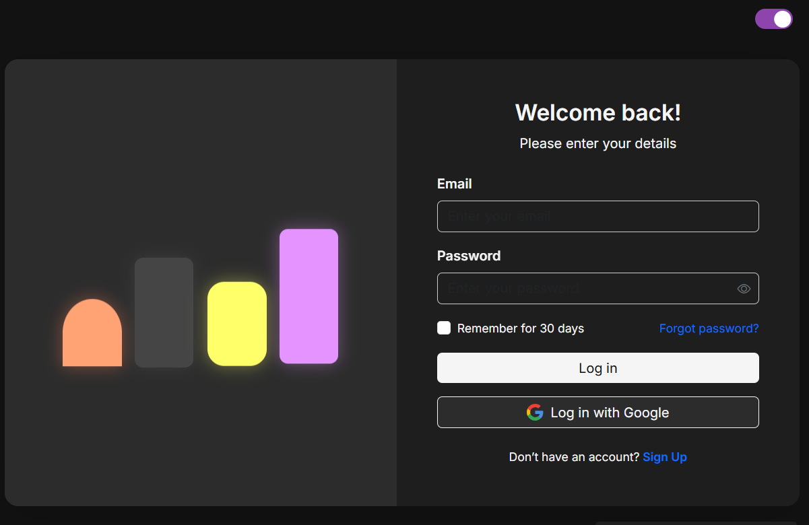

# Login Page with Dark/Light Theme 🌗

A modern, responsive **login page** with dark and light theme support, animated illustration shapes, password toggle, and Google login button. Built with **HTML, CSS, Bootstrap 5, and JavaScript**.  

---

## Features ✨

- ✅ **Dark/Light Mode** toggle with smooth transition  
- ✅ **Responsive Design**: Works on mobile and desktop  
- ✅ **Animated Illustration Shapes** with floating & glowing effects  
- ✅ **Password Visibility Toggle** (eye icon)  
- ✅ **Custom Styled Buttons**: Primary login & Google login  
- ✅ **Theme-aware Buttons**: Button colors change automatically with theme  
- ✅ **LocalStorage Support**: Remembers dark/light mode preference  

---

## Screenshots 🖼️

**Light Mode:**  
  

**Dark Mode:**  
  

---

## Technologies 🛠️

- **HTML5 & CSS3**
  
  
 
- **JavaScript (Vanilla)**
  
  
- **Bootstrap 5**
  
  
- **Google Fonts (Inter)**
  
    
- **Bootstrap Icons**  
  
---
